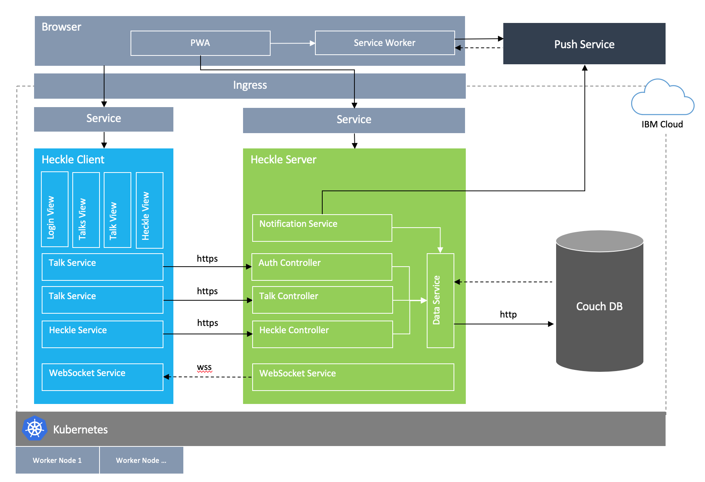
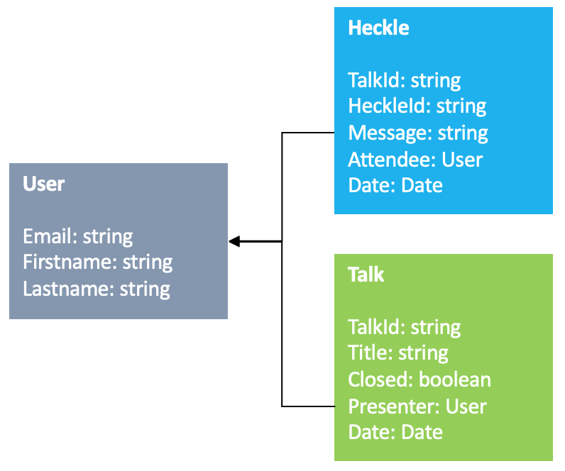

# Architectural Overview

The purpose of the following sections is to provide a high level overview of the Heckle Solution Architecture and the decisions that led to it.

## Architectural Goals

Before going into depth on the heckle architecture, we will define the key non-functional requirements that, grouped by architectural system qualities, drove the development of this architecture.

1. *Support Portability and Openness*: The Heckle Solution is designed in a cloud agnostic manner, meaning that it is designed in a way so that the solution or parts of the solution can run on premise or any cloud provider. The aim is to prevent a vendor lockin for any participant which may join the platform at a later stage.

1. *Support Scalability*: The Heckle Solution must be horizontally and vertically scalable, leveraging the power of an cloud environment. The solution must support at least 400 atendees heckling in parallel about a talk.

1. *Build for Maintainability*: The Heckle Solution must be build on open standards and technologies.

1. *Foster Platform Independency*: The Heckle Solution should build independent from any mobile os.

## Solution Architecture

This section outlines the architectural key concepts for heckle. The technical view divides the heckle into technical components. Splitting software applications into components is a well-established architectural pattern, enabling loose coupling between technical components thus reduces dependencies, increases maintainability, provides more structure as well as clarity.

### Three Tier Architecture

From a technical perspective, see figure above, the architecture of heckle is separated into three tiers: Presentation Tier (Client), Application Tier (Server) and Data Tier (Couch DB). The key reasons were:

* Frontend Tier – The heckle client is a progressive web application, providing the user interface to users. The portal pages provide validation- and business-logic that does not require access to the backend. The validation- and business-logic rules are shared between the heckle client and server. The heckle client is built using scss, angular and typescript.

* Backend Tier – The heckle server is responsible for managing the user authentication / authorization and interaction with the data tier.

* Data Tier – A couch db is setup to store talk and heckle data.

**Architectural benefits**: clarity, structure, benefits for scalability and resilience, supports operability and deployment.

### Layered Architecture

All tiers are layered. The software is built following strict layering principles.

* The heckle client is a progressive web application and layered based on the model view controller (MVC) pattern, on top of a rest service communication layer.
* The heckle server is layered into an integration and a persistence layer.

**Architectural benefits**: reuse, structure, clarity, maintainability, supports operability and deployment

### Security

The following list explains the key considerations for security within heckle.

* All external communication is transported and encrypted via https.
* Heckle is not implementing an authentication service, but intends to integrate a social login using JWT for further communiciation after successfull authenticiaton.
* Permissions are managed based on entities and services. Authorization is evaluated based on the service and the manipulated entities.
* Users of the heckle client will not be able to use functions they are not authorized for. Client functions will either be completely unavailable or be disabled on the user interface.

**Architectural benefits**: scaleability, maintaibability

### Progressive Web Application

The Heckle Solution is build as progressive web application to give the impression of a native mobile application while at the same time support all major platforms. Service worker in combination with the web-push protocol is used to ...

 1. ... produce native notification on mobile devices informing the presenter about heckles to his talk.

 1. ... ensure the authenticity of the received message. Using asymetric encryption the message is validated if submitted from a valid origin.

 1. ... cache application data to reduce loading time.

**Architectureal benefits**: Fosters platform independency, portable and open.

### Data Model

The data model below depicts the data stored to the data tier. The following list provides key considerations for that data model.

* Heckles and Talks are stored independently in order to prevent contengency when 400 atendees heckling about the same talk.

* The Heckle and Talk data entities are namespaced in the Couch DB. e.g. the document id of an heckle is "heckle/[talk-id]/[uuid]". Thus providing two advantages.
    1. The id matches the resource endpoint in the integration layer of the backend service.

    1. The id can be used to easily query all heckles of a talk or a specific heckle.

**Architectural benefits**: scaleability, maintaibability
